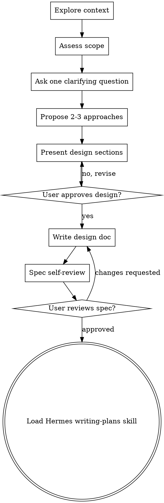

# Brainstorming Ideas Into Designs

Turn rough ideas into approved designs through collaborative dialogue before implementation.

This is a **design gate**. Do not write code, scaffold files, modify behavior, or invoke implementation workflows until you have presented a design and the user has approved it.

## When to Use

Use before:

- Creating features or products
- Building components
- Adding functionality
- Changing existing behavior
- Turning a vague idea into a plan

Do not skip because the task seems simple. Simple tasks can have short designs, but unexamined assumptions still cause wasted work.

## Checklist

Create and complete tasks in this order:

1. **Explore context** — inspect relevant files, docs, existing behavior, and recent commits when a codebase exists.
2. **Assess scope** — if the request spans multiple independent subsystems, pause and propose decomposition before refining details.
3. **Ask clarifying questions** — one at a time; prefer multiple-choice questions when helpful.
4. **Propose 2–3 approaches** — include trade-offs and your recommendation.
5. **Present the design** — section by section, scaled to complexity; get user approval as you go.
6. **Write the design doc** — save the approved design to `docs/superpowers/specs/YYYY-MM-DD-<topic>-design.md`, unless the user or project has a different preferred location.
7. **Self-review the spec** — fix placeholders, contradictions, ambiguity, and scope creep.
8. **Ask the user to review the written spec** — put the complete spec Markdown inside the approval interaction; do not proceed until approved.
9. **Transition to planning** — load and use Hermes' `writing-plans` skill to create the implementation plan.

## Process Flow



The terminal state is **loading Hermes' `writing-plans` skill**. Do not jump directly to implementation.

## Understanding the Idea

- Start by understanding the project or problem context.
- If working in a repository, inspect existing structure before proposing changes. Follow existing patterns.
- If the project is too large for a single spec, help the user split it into sub-projects. Brainstorm the first sub-project through the normal flow.
- Ask one question per message. If a topic needs more exploration, break it into multiple turns.
- Focus on purpose, constraints, success criteria, users, edge cases, and what is explicitly out of scope.

## Exploring Approaches

- Propose 2–3 viable approaches.
- Explain trade-offs: complexity, speed, maintainability, risk, user experience, and testing burden.
- Lead with your recommended option and explain why.
- Apply YAGNI ruthlessly: remove unrequested or speculative capabilities.

## Presenting the Design

Once you understand what should be built, present the design in sections. Scale each section to the work:

- A few sentences for simple tasks.
- Up to 200–300 words for nuanced sections.

Cover the relevant pieces:

- User-visible behavior
- Architecture and boundaries
- Components and responsibilities
- Data flow or state flow
- Error handling and recovery
- Security/privacy implications, if any
- Testing and verification strategy
- Out-of-scope items

After each meaningful section, put the complete reviewable section directly before the approval question in the same user-visible interaction. Show schemas, interfaces, examples, and other structured technical artifacts in a fenced code block. If the user says no, revise before moving on.

## Self-Contained Review Gates

Every approval gate — section-by-section design review and final spec review — must be self-contained: the complete artifact under review and its approval question must be part of the same user-visible interaction.

- When using a structured question or choice tool, put the complete artifact in the tool's visible prompt or question field.
- Use choice labels only to represent decisions, such as **Approve** or **Request changes**. Labels must not carry or replace the artifact.
- An artifact name, local path, summary, attachment, or separate preceding message may supplement the interaction, but cannot substitute for the complete artifact.
- If a tool's content limit cannot hold the artifact, use a plain inline prompt or obtain section-by-section approval with each complete section visible. Never send an empty or content-free choice card.
- If the artifact changes after it was displayed, show the updated complete artifact again before requesting approval. Withdraw and reissue any approval request that referred to unseen or stale content.

### Schema approval examples

**Bad:**

> Does the proposed schema meet your needs?
> Choices: Approve / Request changes

**Good:** structured choice interaction pseudocode

````yaml
question: |
  Proposed schema:

  ```sql
  CREATE TABLE projects (
    id INTEGER PRIMARY KEY,
    name TEXT NOT NULL
  );
  ```

  Does this schema meet your needs?
choices:
  - Approve current schema
  - Request schema changes
````

### Final spec approval examples

**Bad:**

> Spec written to `docs/superpowers/specs/example-design.md`. Please approve it.

**Good:** structured choice interaction pseudocode containing a complete, intentionally short spec (using the same section structure as the canonical template in Documentation below)

````yaml
question: |
  Please review the complete spec below.

  ```markdown
  # Project Records Design

  ## Goal
  Add project records with required names.

  ## Non-Goals
  Importing, exporting, and sharing projects are excluded.

  ## Context
  The application does not currently persist projects.

  ## Proposed Design
  Store each project with an integer identifier and a non-empty name.

  ## Components / Boundaries
  The project repository owns persistence; callers supply names.

  ## Data or Control Flow
  A caller submits a name, the repository validates it, and storage assigns the identifier.

  ## Error Handling
  Reject empty names without writing a record.

  ## Testing / Verification
  Verify valid records are accepted and missing names are rejected.

  ## Open Questions
  None.
  ```

  Do you approve this spec for implementation planning?
choices:
  - Approve complete spec
  - Request spec changes
````

## Design for Isolation and Clarity

Break the system into smaller units with clear responsibilities and interfaces.

For each unit, be able to answer:

- What does it do?
- How is it used?
- What does it depend on?
- Can its internals change without breaking consumers?
- Can it be tested independently?

When existing code has problems that affect the work, include targeted improvements as part of the design. Do not propose unrelated refactoring.

## Documentation

Write the approved design to a spec file. Default path:

```text
docs/superpowers/specs/YYYY-MM-DD-<topic>-design.md
```

Project or user preferences override this default.

The spec should include (this is the canonical section structure referenced elsewhere in this skill):

```markdown
# <Feature / Change> Design

## Goal

## Non-Goals

## Context

## Proposed Design

## Components / Boundaries

## Data or Control Flow

## Error Handling

## Testing / Verification

## Open Questions
```

Commit the design document when working in a git repository and committing is appropriate for the task.

## Spec Self-Review

Before asking the user to review the spec, check it with fresh eyes:

1. **Placeholder scan:** remove placeholder markers, incomplete sections, and vague requirements.
2. **Internal consistency:** fix contradictions between sections.
3. **Scope check:** ensure the spec is focused enough for one implementation plan.
4. **Ambiguity check:** make requirements explicit when they could be interpreted multiple ways.
5. **YAGNI check:** remove features the user did not ask for.

Fix issues inline, then proceed.

## User Review Gate

After the self-review passes, ask the user to review the written spec before proceeding. The approval interaction must include the complete spec Markdown, not just its location or a summary. For example, using the same section structure as the canonical template in Documentation above:

> Complete spec for review:
>
> ```markdown
> # <Feature / Change> Design
>
> ## Goal
> <Complete goal text>
>
> ## Non-Goals
> <Complete non-goals text>
>
> ## Context
> <Complete context text>
>
> ## Proposed Design
> <Complete proposed design text>
>
> ## Components / Boundaries
> <Complete components and boundaries text>
>
> ## Data or Control Flow
> <Complete data or control flow text>
>
> ## Error Handling
> <Complete error-handling text>
>
> ## Testing / Verification
> <Complete verification text>
>
> ## Open Questions
> <Complete open-questions text, or `None` when there are none>
> ```
>
> Do you approve this complete spec so I can create the implementation plan, or do you want changes?

The real interaction must replace every example placeholder above with the full reviewed content. A local path, summary, or attachment may be included for orientation or download, but is supplementary only and never replaces the complete spec in the approval interaction. If a structured tool cannot fit the content, use a plain inline prompt or section-by-section approval rather than a content-free choice card.

If the user requests changes, update the spec and repeat the self-review. Only proceed once the user approves.

## Handoff to Hermes Writing Plans

After the user approves the written spec, load and follow Hermes' `writing-plans` skill to create a detailed implementation plan.

In Hermes, this means using the installed `writing-plans` skill rather than an upstream Superpowers repo-relative reference.

Do not invoke another implementation skill before `writing-plans` has produced the plan.

## Key Principles

- **One question at a time** — do not overwhelm the user.
- **Multiple choice preferred** — easier to answer than open-ended prompts when possible.
- **YAGNI ruthlessly** — remove unnecessary features from every design.
- **Explore alternatives** — present 2–3 approaches before settling.
- **Incremental validation** — present design sections and get approval before moving on.
- **Self-contained approval** — include the complete artifact and decision question in the same interaction.
- **Evidence over guessing** — inspect the codebase when the answer can be discovered.
- **Design before implementation** — no code or scaffolding before approval.

## Red Flags

Never (these restate the Self-Contained Review Gates rules above as explicit prohibitions):

- Ask the user to approve a schema, design section, or spec that is not completely visible in the approval interaction.
- Treat a path, summary, attachment, choice label, or separate preceding message as the reviewable artifact.
- Request approval for stale content after the artifact has changed; show the updated complete artifact again.
- Use a content-free choice card because the complete artifact exceeds the tool's limit; switch to a plain inline prompt or complete section-by-section review.
- Proceed to implementation or `writing-plans` before the applicable visible artifact is approved.

---

Adapted for Hermes Agent from obra/superpowers `brainstorming`, with the Superpowers repo-relative `writing-plans` handoff changed to Hermes' installed `writing-plans` skill and the browser visual companion omitted for portability.

This skill now lives under the Hermes Superpowers collection at `hermes-skills/superpowers/brainstorming`; install it via that full repository path.
